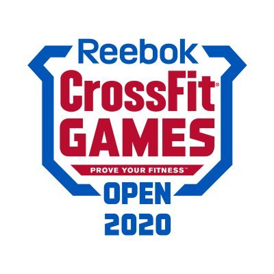

# 2020 CrossFit Games Open
**Author:** Scott Graham
**Data link -** https://www.kaggle.com/datasets/jeanmidev/crossfit-games

## Overview

The CrossFit Open is the largest single sporting competition held worldwide. The competition is held over a five week period with one workout per week to be submitted by participants.

The goal of this analysis is to view the data retrieved from the 2020 CrossFit Open and the athletes that have competed and determine if there are any standout features that make the top atheletes great including weight and height. The impact of age on performance.

## Data Understanding

Review data and removal of unnecessary columns. Remove duplicates of athletes that are listed in multiple divions to just keep all athletes saved in the open division. That includes isolating athletes older than 55 years old that are not classified in the open division anymore.

Initial data kept and reviewed were:
* competitorid
*competitorname
*postcompstatus
*gender
*country
*affiliatename
*age
*height_m
*weight_kg
*overallrank
*overallscore
*division

Initial checks using histograms, KDE and scatter plots to review baseline data.