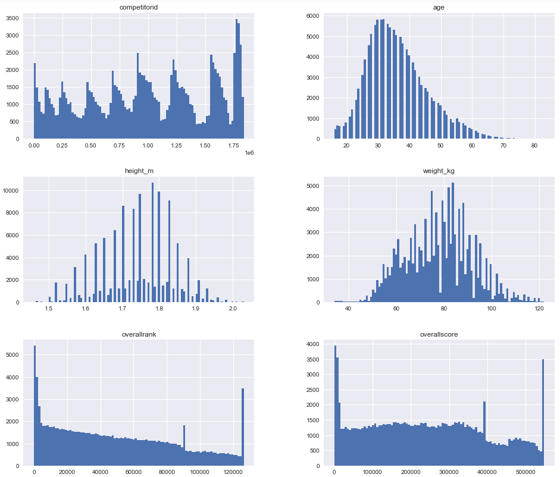
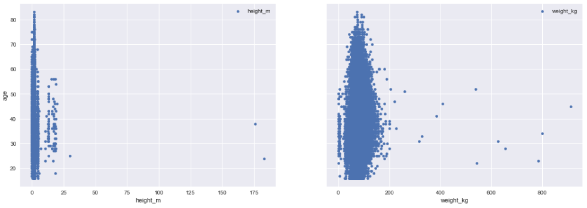
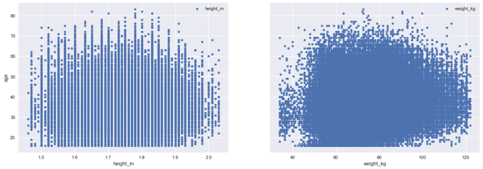
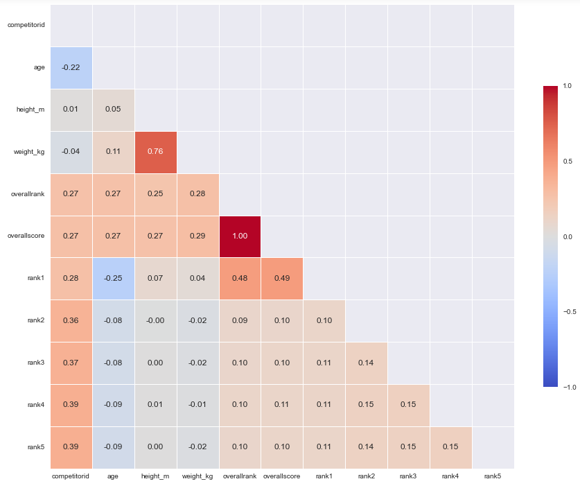
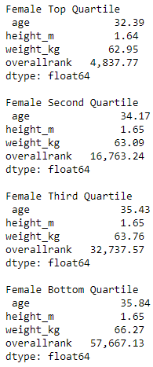
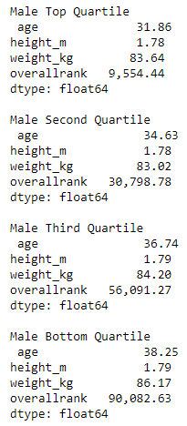
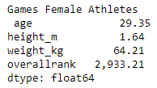
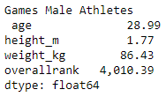

# 2020 CrossFit Games Open
**Author:** Scott Graham

**Data link -** https://www.kaggle.com/datasets/jeanmidev/crossfit-games

## Overview

The CrossFit Open is the largest single sporting competition held worldwide. The competition is held over a five week period with one workout per week to be submitted by participants.

The goal of this analysis is to view the data retrieved from the 2020 CrossFit Open and the athletes that have competed and determine if there are any standout features that make the top atheletes great including weight and height. The impact of age on performance.

## Data Understanding

Review data and removal of unnecessary columns. Remove duplicates of athletes that are listed in multiple divions to just keep all athletes saved in the open division. That includes isolating athletes older than 55 years old that are not classified in the open division anymore.

Initial data kept and reviewed were:
* competitorid

*competitorname

*postcompstatus

*gender

*country

*affiliatename

*age

*height_m

*weight_kg

*overallrank

*overallscore

*division

Initial checks using histograms and scatter plots to review baseline data.

## Data Cleaning

Removal of obvious outliers from scatter plots, as seen above, and then perform a proper outlier removal using Z-Score.

I then a correlation visualisation to further evaluate useful parameters to find overall rank.

## Regression Analysis

Perform a Train-Test-Split at 70/30 split to provide a Mean Square Error for both the training model and the test model.

The MSE between the training and test model was quite close:
Train Mean Squarred Error: 0.8786019484413052
Test Mean Squarred Error: 0.8900844629714001

However our R-Squared value was only 0.155, meaning our data had only a 15.5% chance of predicting the athletes overall rank from their age, weight, height and gender.

## Further Analysis

Split datasets into 4 quartiles in each gender and compared the mean values of each of the quartiles vs each other and then compared to the Games athletes.

 

 

## Conclusions

I was unable to produce a predictive model based on my original parameters of using height, weight and age as predictors of results. This is obviously due to many other parameters around fitness. I have broken the results into male and female components and compared the mean of the different quartiles and used them to compare against one another and the top athletes in the world (Games Athletes).

As expected the better the result the younger the athlete. Interestingly the weight didnt fluctuate between the quartiles as much as I would have expected. It was more significant in a combined male and female comparison.

## For More Information

Please review my full analysis in the Jupyter Notebook. For more information contact Scott Graham, scottgraham14@gmail.com